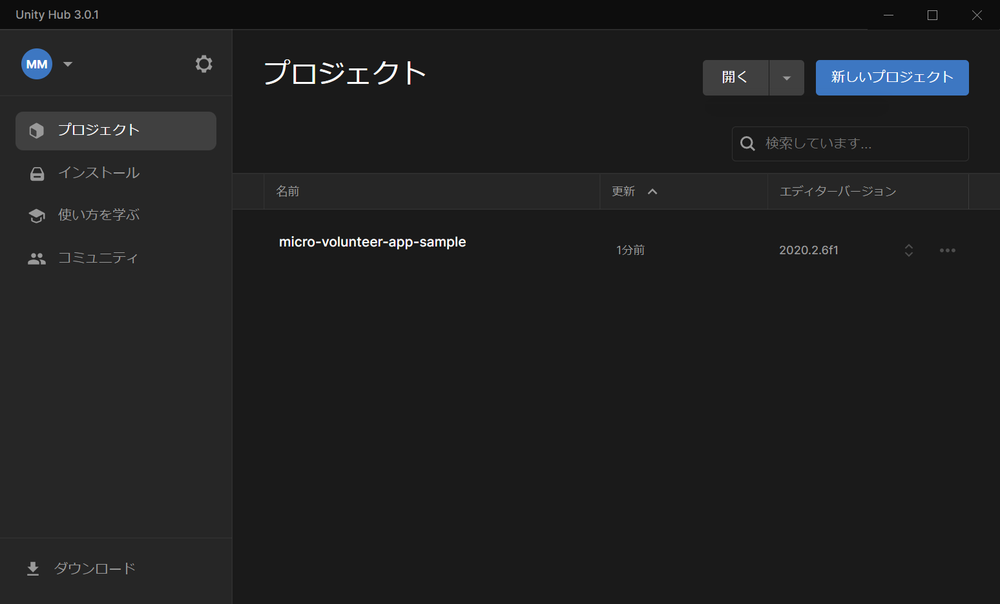
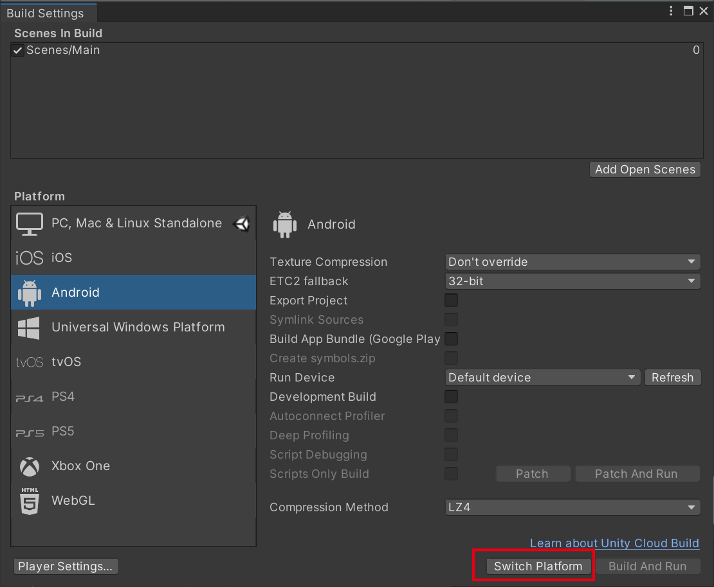
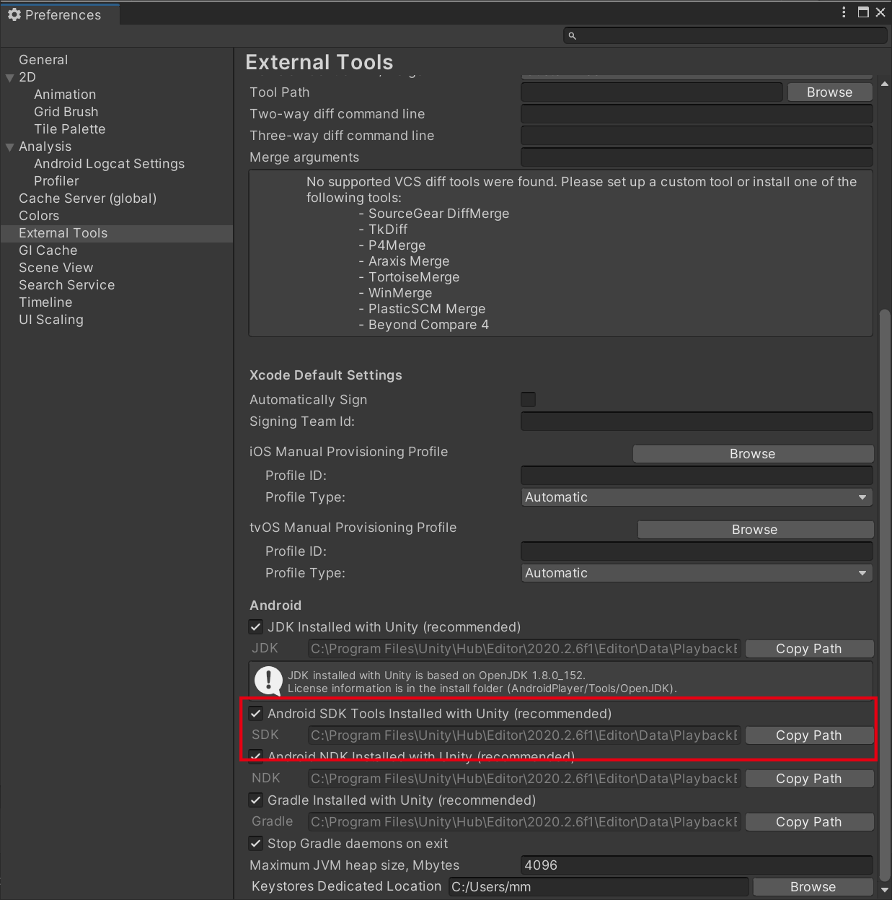
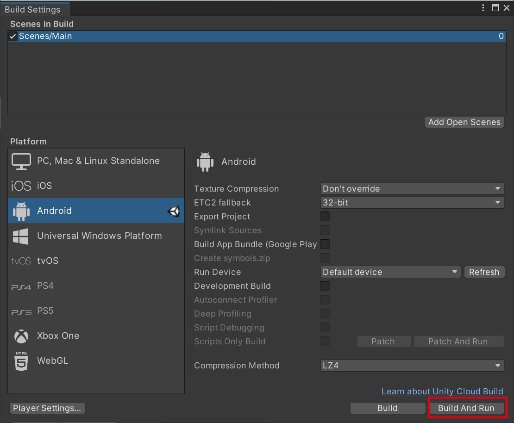

# 予備知識

<dl>
  <dt>Unity</dt>
  <dd>Unity Editorで作られたアプリの実行環境です。ただ、文脈によってはUnity Editorを指す場合もあります。</dd>

  <dt>Unity Editor</dt>
  <dd>開発環境です。IDEです。Editor上で実行も出来るのでエンジンも内包しています。画面周りの設計や定義を行います。コードの記述（C#言語）は、他のエディタを使用します。個人利用では基本的には無料ですが、条件によっては有料プランへの加入が必要になります。</dd>

  <dt>Unity Hub</dt>
  <dd>Unity Editorのインストーラ＆新規プロジェクトの作成＆プロジェクトをUnity Editorで開いて起動するためのソフトです。Unityには細かなバージョンがあり、バージョンごとにEditorをインストールすることが可能です。また、Unity EditorでAndroidやiPhone向けビルドを行うには、それぞれに異なるライブラリをインストールする必要があり、そういった環境の構築を行うためのツールです。</dd>
</dl>

# Unity開発環境の構築

## Unity Hubのインストール

[Unityをダウンロード](https://unity3d.com/jp/get-unity/download)のページから、「Unity Hubをダウンロード」を選択します。インストーラがダウンロードされるので、インストールします。

## Unityのインストール
Unity Hubを起動して、左側メニューからインストールを選び、右上のエディタをインストールをクリックします。

インストールしたいバージョンを選択します。ここに出てこないバージョンは、「アーカイブ」をクリックして、「ダウンロードアーカイブ」をクリックします。
Webブラウザで[アーカイブサイト](https://unity3d.com/jp/get-unity/download/archive)が開きます。

開発しているプロジェクトのUnityのバージョンと合わせる必要があるので、プロジェクトリポジトリにあるバージョンファイルを確認します。

https://github.com/urashin/micro-volunteer-app-sample/blob/master/ProjectSettings/ProjectVersion.txt

このドキュメントの執筆時点では、プロジェクトで使うUnityのバージョンは「2020.2.6f1」となっています。Unityの[アーカイブサイト](https://unity3d.com/jp/get-unity/download/archive)から、Unity 2020.xのタブをクリックして、Unity 2020.2.6の箇所の「Unity Hub」のアイコンをクリックします。

Unity Hubから、Unityのインストールが始まります。インストールの途中で追加するモジュールを聞かれますので、以下の項目にチェックを入れてください。
* Android Build Support
* Android SDK & NDK Tools
* OpenJDK
をインストールしてください。

ドキュメントは不要です。

## リポジトリのクローン

[プロジェクトのリポジトリ](https://github.com/urashin/micro-volunteer-app-sample/tree/feature/AppBuildManual)をCloneするか、ファイル一式をZIPファイルとしてダウンロードして、展開しておきます。

## UnityEditorで開く

Unity Hubを起動し、右上の「開く」をクリックします。先にクローンしたフォルダ（micro-volunteer-app-sample）を選択します。
プロジェクト（フォルダ）を開くと、Unity Editorが起動します。

 

Unity Editorが起動したら、メニューのFile → Build Settingsを選択します。初期状態ではPlatformがPC, Mac & Linuxとなっているので、ここをAndroidを選択して、右下の「Switch Platform」ボタンを押します。

 

## Android端末のADB接続

Andorid端末をPC/Macに接続してデバッグ用端末として認識させます。これはUnity Editor固有の機能ではありません。
ここでの説明は省略しますが、やることとしては、
* Android端末を開発者モードにしてADBデバッグを有効にする
* PC/Macに端末用のUSBドライバを入れる
となります。

Unityのインストール時に、Android SDK Toolsもインストールしているので、ADBコマンド等のツールもインストール先にあります。Unity EditorのメニューからEdit → Preferencesを選び、Andoridの項目のAndroid SDK Tools Installed with UnityのPathを参照してください。platform-toolsフォルダにADBコマンドが入っています。あらかじめ、ADBコマンドでAndroid端末が認識されているかを確認しておくとよいです。

 

## ビルド＆RUN

Unity Editorのメニューから、File → Build Settingsを選択します。右下のBuild & Runボタンを押すと、APKの保存先パスを聞いていますので、適当な名前を付けて保存します。ビルドが開始されてエラーがなければ、Android端末にAPKが自動的に転送＆実行開始されます。

 

## APK単体インストール

先にビルドしたAPKをなんらかの方法でAdnroidデバイスに持っていけば、インストール可能です。